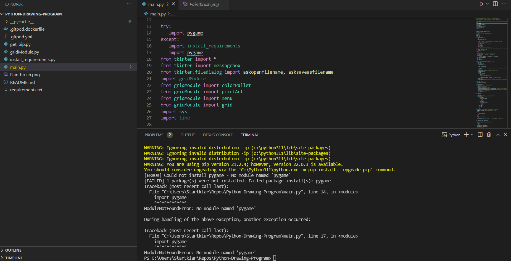
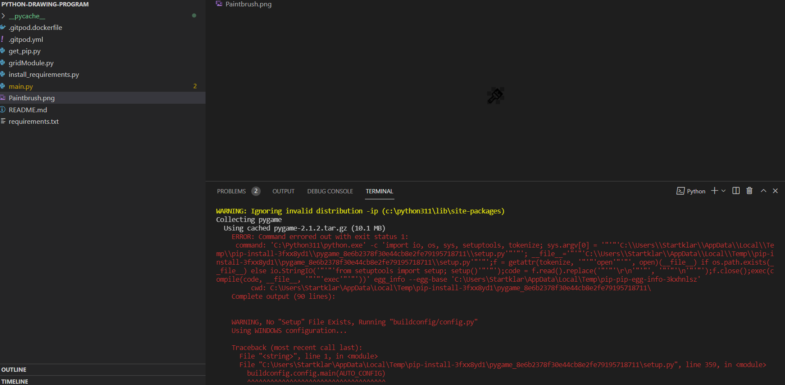
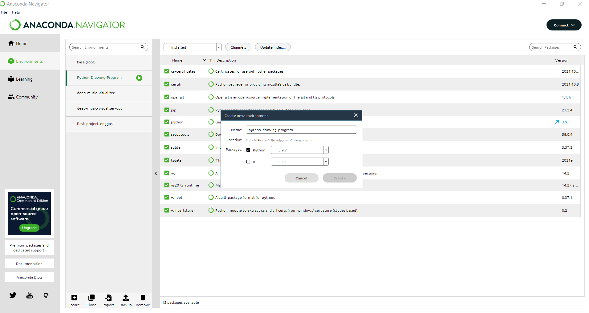
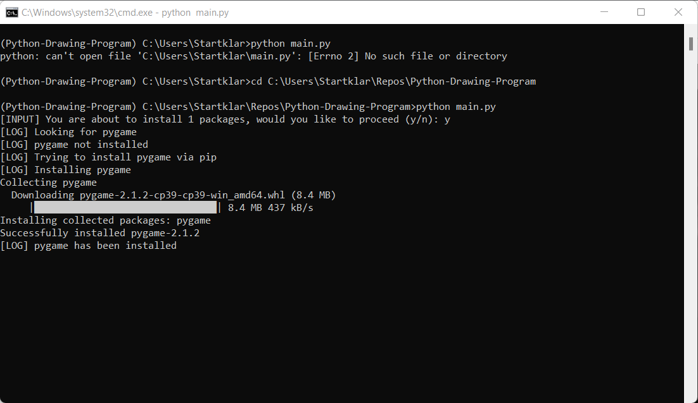
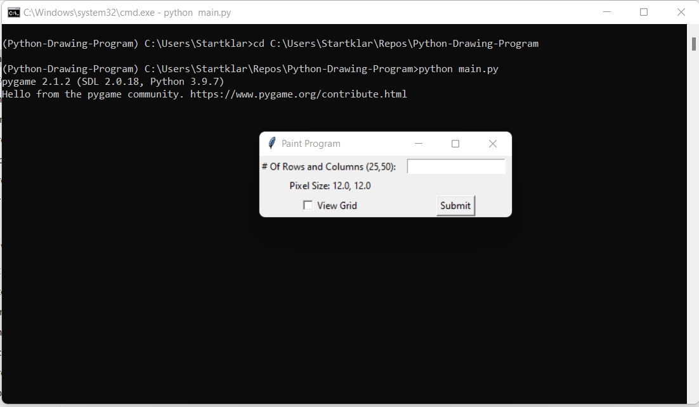
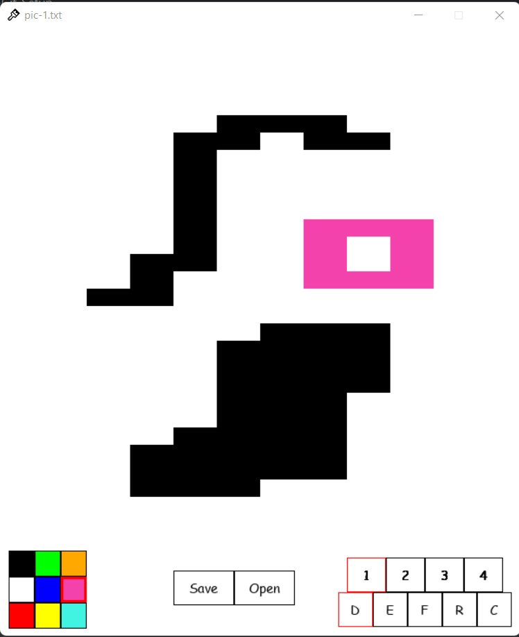
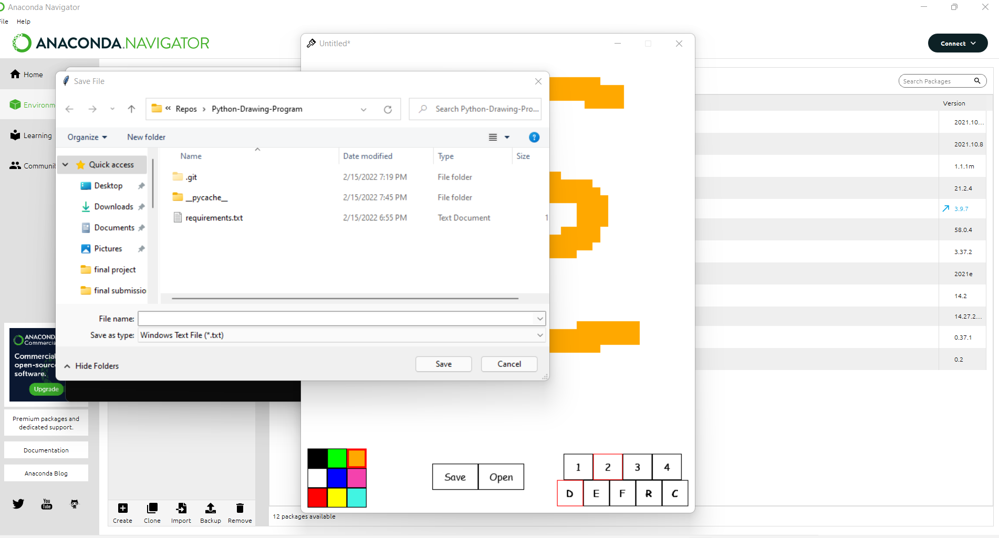

# Python-Drawing-Program
A python program similar to Microsoft paint. It allows you to use a variety of drawing tools on a pixel grid to create drawings. It features the ability to save and load work created within the program.

# Requirements
- Python 3.x
- TKinter
- Pygame

# Run in Gitpod

You can also run Python-Drawing-Program in Gitpod, a free online dev environment for GitHub:

If you're intersted in a paid subscription with GitPod use the coupon code: **TECHWITHTIM19**

Please Note: The GUI is a little glithcy in GitPod. For best results expand the VNC window to be full screen.

# Repo challenges faced to be solved 

1- cloning repo to VS code  

2-realizing that pygame is not installed 

3-opening file in Anaconda to have pip and pygame environment for python file 

4-open anaconda terminal and open file directory and run main.py file 

5-

6-opening drawing window with different options for drawing 

7-You can save the picture drawn 
